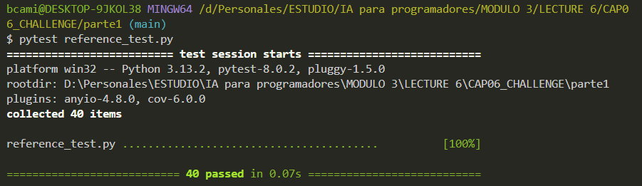
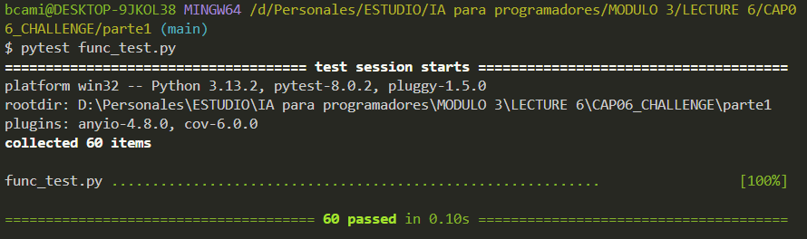

# REPORTE DE REFLEXION

## Primer desafio

### Entender la funcion es_primo e identificar qué casos están siendo cubiertos adecuadamente y qué casos podrían estar faltando.

La implementación actual:
Ñ
La función es_primo está diseñada para determinar si un número dado es primo o no. Un número primo es aquel que solo es divisible por 1 y por sí mismo.

- Itera desde 2 hasta num-1 Para cada número en ese rango, verifica si num es divisible por él Si encuentra un divisor, retorna False (no es primo) Si completa el bucle sin encontrar divisores, retorna True (es primo)

- Casos que cubre correctamente Números primos positivos mayores a 2 (como 3, 5, 7, 11, etc.)Algunos números no primos positivos mayores a 1 (como 4, 6, 8, 9, etc.)

- Casos que no cubre correctamente:

  - Números especiales pequeños: No maneja correctamente el caso de num=2 (que es primo pero el bucle no se ejecuta)
  - No maneja correctamente el caso de num=1 (que no es primo por definición)
  - No maneja correctamente el caso de num=0 (que no es primo)
  - Números negativos: No define comportamiento para números negativos (que no son primos)
  - Tipos de datos no enteros: No valida si la entrada es un número entero
  - No maneja flotantes, strings, booleanos, None, etc.

- Eficiencia: Es ineficiente para números grandes, ya que verifica todos los posibles divisores hasta num-1
- No implementa optimizaciones como verificar solo hasta la raíz cuadrada de num
- No implementa optimizaciones como verificar solo divisibilidad por 2 y números impares

- Precisión en punto flotante:
  - No maneja números de punto flotante que están muy cerca de enteros

## IMPLEMENTACION DE PRUEBAS UNITARIAS

### DIFICULTADES ENCONTRADAS

- La principal dificultad encontrada fue la correcta implementación de las pruebas unitarias, ya que se tuvo que realizar un análisis de la función es_primo para poder identificar los casos de prueba adecuados.

- El hecho de no comprender completamente el lenguaje de programación Python y la estructura de las pruebas unitarias también fue un desafío.

- Analizar junto con la IA los edge cases fue relativamente facil, ya que al darle mayor contexto sobre lo que se requeria, brinda un gran soporte sobre cuales son los posibles casos adicionales que se deben considerar, como por ejemplo: los numeros que tienden a infinito.

### RESULTADO DE PRUEBAS REFERENCE_TEST

### RESULTADO DE PRUEBAS FUNC_TEST

# IMPORTANCIA DEL TESTING EN EL DESARROLLO DE SOFWARE

- El testing en el desarrollo de software es esencial para garantizar la calidad del software, asegurar que funcione correctamente y cumpla con los requisitos especificados.
- Ayuda a detectar y corregir errores en el proceso de desarrollo.
- Mejora la confiabilidad y la estabilidad del software.
- Facilita la colaboración entre equipos de desarrollo y asegura que el software cumpla con los estándares de calidad.
- Garantizar que el software funcione correctamente y cumpla con lo que se espera obtener..
